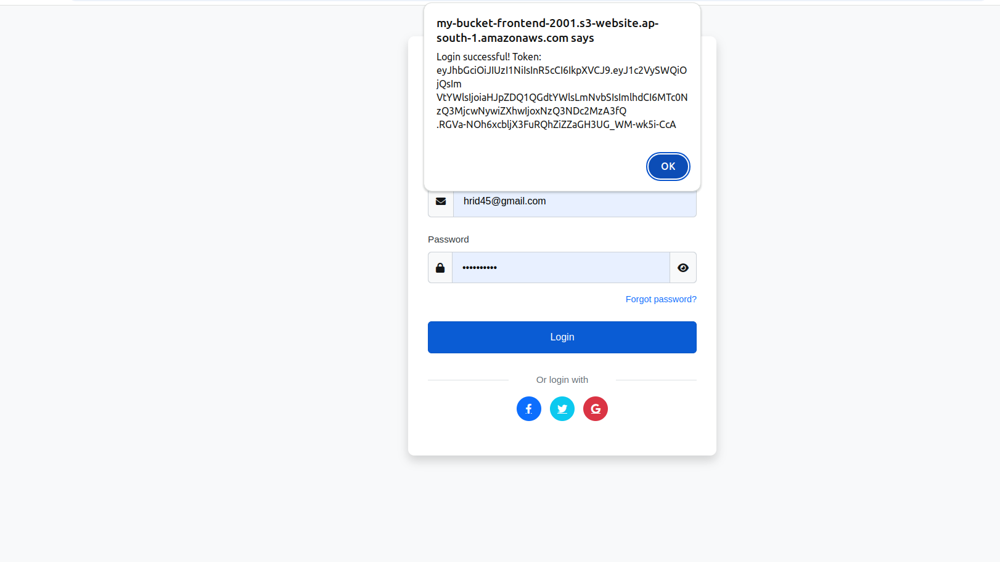

# BasicLogin-AWS-deployment

This project demonstrates how to deploy a full-stack web application on AWS with a public backend, a private database, and static frontend hosting using the following architecture,

- Frontend: Static website hosted on Amazon S3

- Backend: Node.js application running on an EC2 instance (public subnet)

- Database: PostgreSQL managed by Amazon RDS (private subnet)

- Networking: AWS VPC with public and private subnets, route tables, and an Internet Gateway

## Architecture Diagram

## Tools and Technologies Used

- **AWS VPC** – for network isolation
- **Amazon EC2** – to host the backend (Node.js)
- **Amazon RDS (PostgreSQL)** – managed database service
- **Amazon S3** – static website hosting for frontend
- **Docker** – containerization of backend app
- **psql** – PostgreSQL command-line tool

## Components
- Frontend:
Static files (HTML) hosted in an S3 bucket with static website hosting enabled.

- Backend:
Node.js application (from backend/ folder) running on an EC2 instance in the public subnet. Exposed to the internet via a public IP.

- Database:
PostgreSQL RDS instance deployed in a private subnet. Only accessible from within the VPC (specifically, the EC2 backend).

## Setup Instructions
1. Networking Setup (VPC & Subnets)
  - Create a new VPC.
  
  - Add a public subnet (for EC2) and a private subnet (for RDS).
  
  - Attach an Internet Gateway to the VPC.
  
  - Configure route tables:
  
  - Public subnet routes internet traffic through the IGW.
  
  - Private subnet has no direct internet access.
  

2. EC2 Instance for Backend
  - Launch an EC2 instance in the public subnet.
  
  - SSH into the instance.
  
  - Install Docker
  
  - Clone the GitHub repository:
    
  bash
  git clone <this-repo-url>
  
  - Build and run the backend:
    
  bash
  cd backend
  docker build -t backend-app .
  docker run -d -p 5000:5000 backend-app
  Or
  node server.js

   

3. RDS PostgreSQL Setup
  - Create an RDS PostgreSQL instance in the private subnet.
  
  - Ensure security group allows inbound connections from the EC2 instance.
  
  - Connect from EC2 using:
    psql -h <RDS-endpoint> -U postgres -d postgres
  
  - Create database and user table:
    sql
    CREATE DATABASE myappdb;
    \c myappdb
    -- Create 'user' table as per backend requirements

     

4. Hosting Frontend on S3
  - Build the frontend project:
  
    bash
    cd frontend
    npm run build
    Create an S3 bucket (e.g., my-bucket-frontend-2001).
  
  - Upload the build files to the bucket.
  
  - Enable static website hosting.
  
  - Set bucket policy to allow public read access for static files.

    

5. Integration
  - Update frontend API URLs to point to the EC2 backend (e.g., http://<EC2-public-ip>:5000).
  
  - Ensure security groups and CORS policies allow communication between frontend and backend
    

## Errors Faced & Troubleshooting
1. EC2 Instance Not Accessible via SSH

  Cause: Security group missing inbound rule for port 22.
  
  Solution: Added SSH (port 22) rule for my IP in EC2 security group.

2. Backend Not Reachable from Frontend
  
  Cause: EC2 security group missing inbound rule for port 5000.
  
  Solution: Added HTTP (port 5000) rule for 0.0.0.0/0 (for testing).
  
3. RDS Connection Refused

  Cause: RDS security group not allowing inbound traffic from EC2.
  
  Solution: Modified RDS security group to allow inbound PostgreSQL (port 5432) from EC2’s security group.

4. CORS Errors in Frontend

  Cause: Backend did not allow requests from S3 frontend domain.
  
  Solution: Enabled CORS in backend server for S3 bucket URL.

5. Database Table Not Found

  Cause: user table was not created before running backend.
  
  Solution: Manually created the required table in PostgreSQL.

## Credits
Original repository cloned from [friend’s repo link here].

AWS documentation and tutorials.

